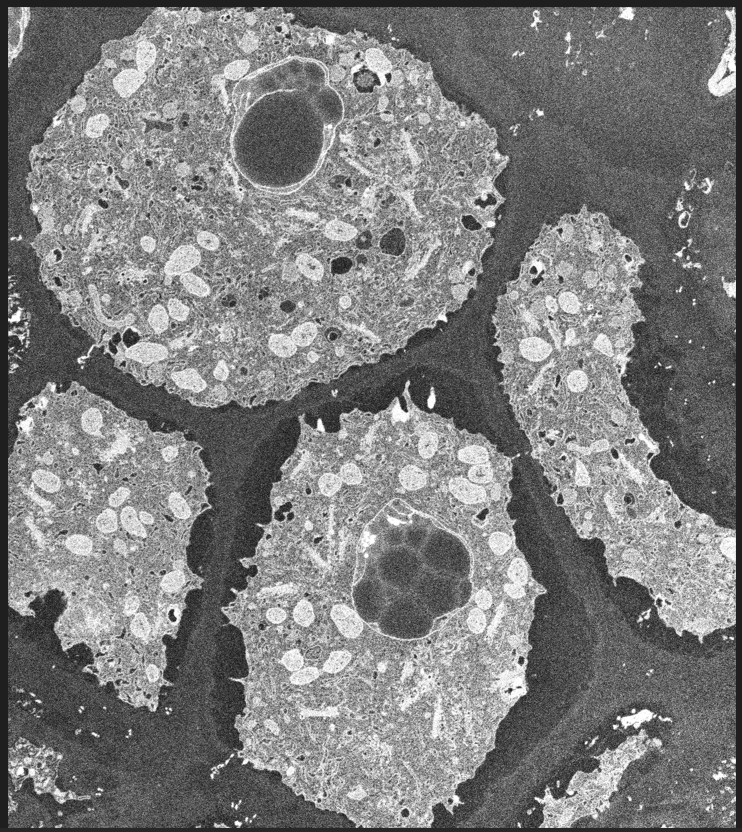
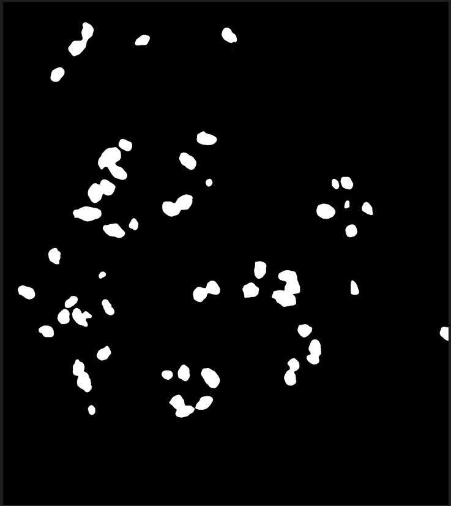
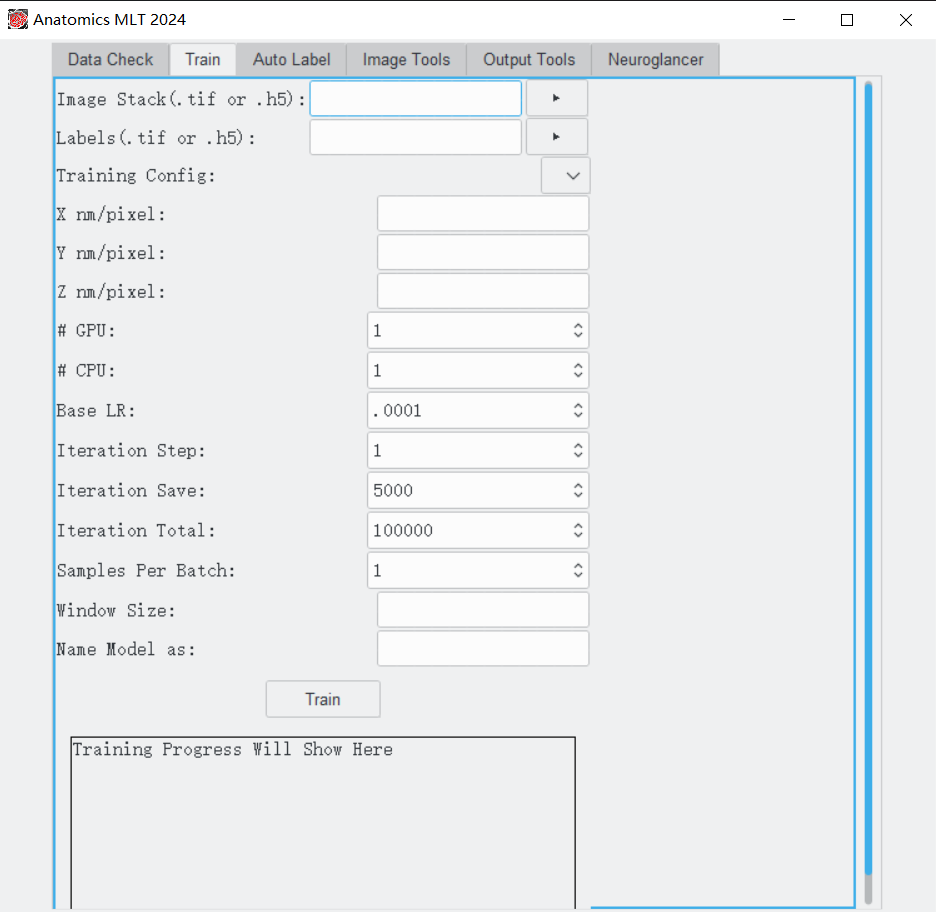
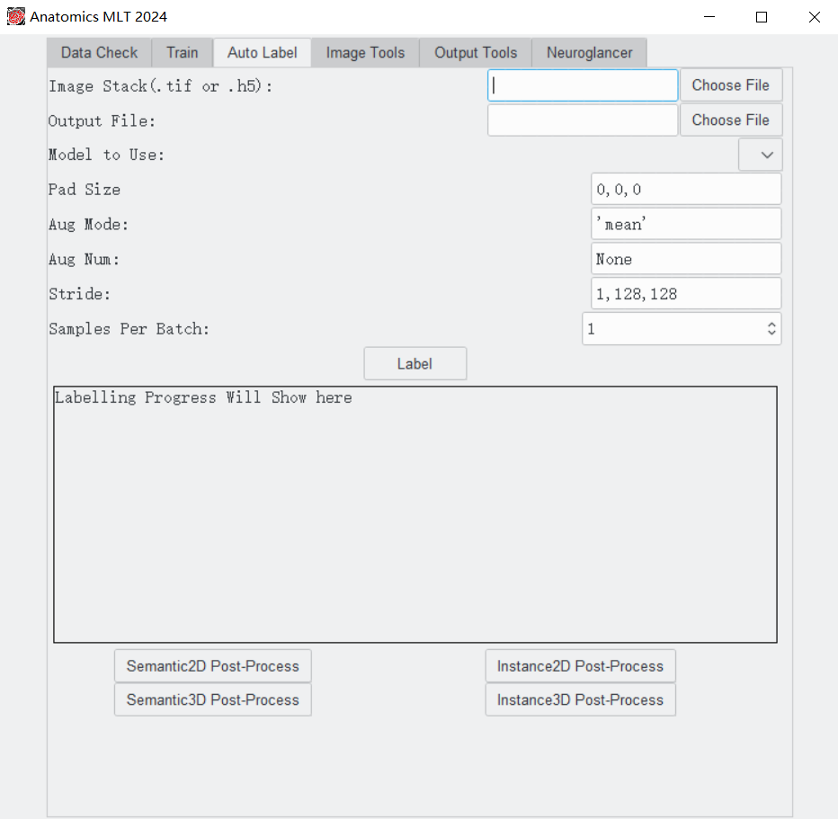
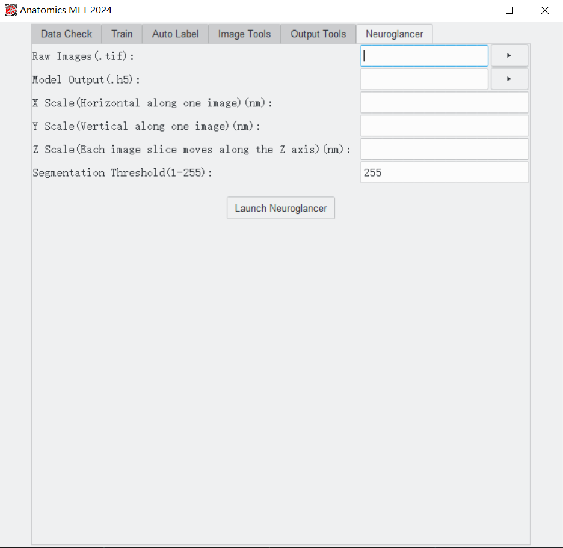

# Quickstart Guide
After installation of Anatomics MLT 2024 [here](installation.md) a test training may be accomplished by following the instructions below.  

  

> This tutorial presents an example of a semantic3D segmentation.  

  

## Open Program 

  

Open miniconda by clicking start, typing miniconda, and selecting "Anaconda Prompt (Miniconda3)". Then type the following: 

```bash 

cd Documents 

cd WSU_PlantBio_ML 

conda activate plantTorch 

python gui.py 

``` 

The main program should now be visible on your screen (if "python gui.py" does not work, try "python3 gui.py"). The window should look like this: 

  

 

  

## Training Images and Labels 

The first step is to obtain a training set of images, and a training label set. Here is an example of a training image: 

 


Here is an example of a training label: 

 

When using the models/algorithms in this program, it is important that image stacks are combined into one stacked .tif file. 

Because we are running a semantic segmentation task, for input "Labels" images, the background is black and all instances are 1 (white).  


 ## Data Check 

 

After producing a training dataset, the data format can be checked for accuracy in Anatomics MLT in the  “Data Check” tab.  Select the original image data stack in the upper box and the label stack that was generated from the image stack in the lower box. Click “Launch Neuroglancer”. Depending on the size of the file, a blue link will appear after a few seconds. Click the link to view the data in your browser. After Neuroglancer opened, there will be four sub-windows. Each represents a different view perspective (e.g. xy axis view; xz axis view; etc). We recommend using the view window to the lower right. In the top right corner of this sub window is a small button to enlarge the window. You may use your mouse scroll wheel to move between different z-layers of the image stack.  

Put the cursor on a certain region. In the top left corner (next to “labels”) a number will display showing the value of the pixel defined by the cursor position. This number must show “0” if the cursor is positioned over the background. If the cursor is moved into an area where a specific organelle is labeled, this number must be larger than “0” (1,2…). A number other than “0” means the pixel is part of a label. 

The preferred data format for semantic labels is 8-bit. The background has no color and the value “0”(usually black). All targets should have the same color (e.g. “1”, typically white).  For example, if the image has 5 different mitochondria, the background should be black, and each mitochondrion will be labeled in the same color (e.g. white) 

For an instance task, the preferable data format will be 8-bit. The background value must be “0”, and values for individual labeled areas (e.g. individual organelles) will have a value 1 to N (N stands for the number of different instances).  For example, if the image has 5 different mitochondria, the background should be black, and each mitochondrion will be labeled in a different color (e.g. blue, white, red, green, orange) to distinguish between each instance.  

 

## Training  

To show the training window, click the "Train" tab on the toolbar on top. In the following we will show an example training with provided image stack and label stack. 

  

The window should look like this: 

  

 

  

- [ ] Next to "Image Stack (.tif or .h5)", click the triangle button to the right, and select "ExampleData/images 25-43_8-bit.tif" 

- [ ] Next to "Labels (.tif or .h5)", click the triangle button to the right and select "ExampleData/labels 25-43_8-bit adjusted 2.tif" 

- [ ] Select the Training Config to be “Semantic3D.yaml” 

- [ ] The example stack was created at x 10 = nm, y = 10 nm and z = 40 nm. Please type the appropriate numbers in the boxes labeled X, Y, and Z nm/pixel. 

- [ ] In the text box labeled "Iteration Total", enter 10000 

> Note: If you want to modify these boxes that has a default number input, please avoid using commas. For example, use 10000 and do not use 10,000. 

- [ ] In the text box labeled "Window Size:", enter 3,129,129 

- [ ] In the text box labeled "Name:", give the model a name, for example: "Tutorial Network" 

- [ ] Next click the train button near the bottom. Information should start appearing in the text box on the bottom. This process can take a long time depending on the capabilities of the used computer. The text box will provide information on the Iteration number and an expected time to completion the training. The training is complete when the last line reads "Rank: None. Device: cuda. Process is finished!" 

  

## Automatic Labelling 

  

Now that the model is trained, automatic labelling can be attempted. Click the tab "Auto-Label" near the top of the program. The window should now look like this: 

  

 

  

- [ ] In the "Image Stack (.tif)" selector, click the "Choose File" button, and in the dialog that pops up, select ExampleData/images 25-43_8-bit.tif 

> Note, it is not good practice to test the accuracy of a model on the same data that it was trained on. However, we will use the same training images here for illustration purposes. 

- [ ] Click the "Choose File" button for "Output File:" and save the file as "ExampleData/myFirstPrediction". 

- [ ] Click the selection box to the right of "Model to Use:" and select "Tutorial Network". 

- [ ] Click label. This can also take a while but should be significantly shorter than the training. The output text box will print lines with information on "progress: {number}/{number} batches, total time {the estimated time to completion}. When the prediction is finished, the last line will read "Rank: None. Device: cuda. Process is finished!" 

- [ ] Click Semantic post-process. This will post-process the initial output and generate the final data output.   

> Note: If your files are not in the same folder, an error may show in the Anaconda prompt. You will need to reselect the file name under “chose file” and click "yes” when the question “file already exists. Do you want to overwrite” appears.   

## Get Sample Stats 

 

Now that the prediction is done, you can use the program to get statistics for the sample. Click the tab "Output Tools" near the top of the program. The window should now look like this: 

  

 

  

- [ ] In the file chooser labelled "Model Output (.h5)", click on "Choose File", and select "ExampleData/myFirstPrediction.h5" (if post processing was used the file will have the name " ExampleData/myFirstPrediction.h5_s3D_out") 

- [ ] In the file chooser labelled "CSV Output", click on "Choose File" and select a file name for the CSV file with output statistics. 

- [ ] Click on the button named "Get Model Output Stats". The program will show the min, max, mean, median, standard deviation, sum, and count of auto-labelled instances (e.g. mitochondria) in the sample. It will also generate an Excel (.CSV) file in your designated path. 

Please note, with only 10000 iterations for the training, the data will not be very accurate but sufficient to learn the general process. 

  

  

## Visualize 

  

- [ ] Click the Neuroglancer tab. 

- [ ] Select the Raw Image and Model Output by typing the name or using the interactive button. 

- [ ] Enter the 'Z scale', 'X scale', and 'Y scale'.  

- [ ] Enter 255 in 'Segmentation Threshold (1-255)' 

- [ ] Click the "Launch Neuroglancer" to launch the visualization work. Once the visualization is ready, a blue link will show up in the software window. You can either click the link or copy and paste it to our browser to view the result.  

