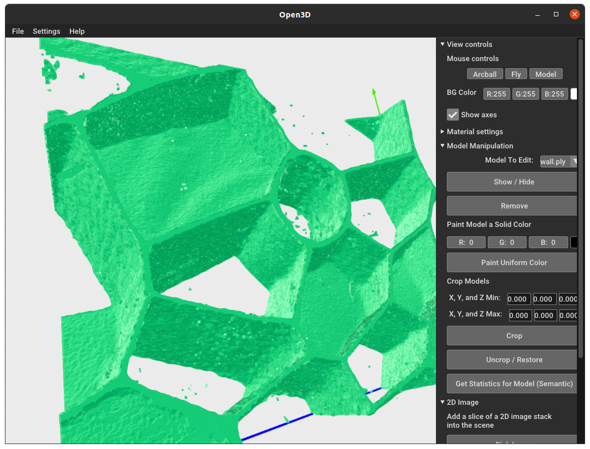

<!-- # Visualize

This screen lets you see your 3D geometries, as well as do some manipulations like cropping, and placing slices of an image in the 3D model where they correspond.

Here, you can add .ply files to the list of files to visualize by clicking the choose file button. You can choose as many or as few files as you want.

You can also pick the Choose Color button for each file. This will let you choose what color that specific file will be in the visualization

> For layers created by instance segmentation, the Choose color will be ignored, and colors will be assigned randomly to differentiate the different instances of the organelles.

Click the visualize button, and after some brief calculation and file loading, a 3D visualization window should appear that is interactive. -->

# Visualize

This tab allows the use of Neuroglancer, a visualization package, to visualize the generated data. 

 

Raw Images: Select the image stack that was used for the auto-label process.  

Model Output: Select the .h5 file that was generated during the auto-label process. If you used a semantic 3D model, the file would end with “.h5_s3D_out”; If you used an instance 3D model, the file would end with “.h5_i3D_out”.  

X Scale, Y scale, Z scale: Enter the X scale, Y scale, and Z scale. Neuroglancer needs to know if there are non-square pixel dimensions.  

Segmentation threshold: This is a number between 0 and 255 and can cut off certain grayscales. Use 255 to keep all data.   

Click "Launch Neuroglancer". Once the visualization is ready (which may take a moment), a blue link will appear in the software window. Clicking the link will open the default browser and will display the reconstruction. 
